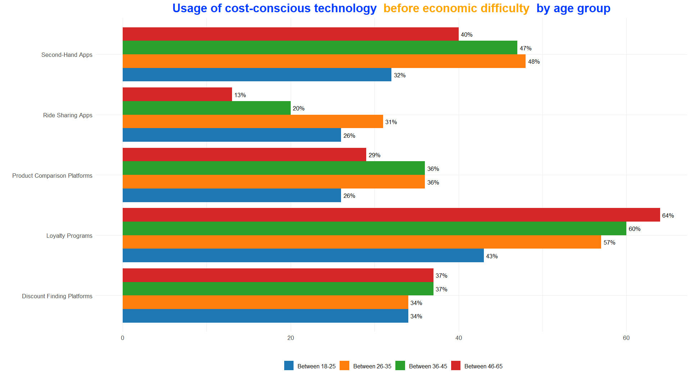

# Explanation of Visualization Code



This R script demonstrates how to create a dummy visualization showcasing the usage of cost-conscious technology across different age groups before economic difficulties. The visualization is crafted using the ggplot2 library, enhanced with ggtext for styled text, and uses a structured dataset created manually. Below is a detailed explanation of each step in the code:

## 1. Required Libraries

The script leverages three libraries:
* `dplyr`: A data manipulation library (though not explicitly used in this code, it’s often included for additional flexibility in handling data).
* `ggplot2`: Used for creating the bar chart visualization.
* `ggtext`: Allows for rich text formatting, such as adding styled HTML in titles or labels.

```R
library(dplyr)
library(ggplot2)
library(ggtext)
```

## 2. Data Creation
The data represents hypothetical values of usage percentages for five categories of cost-conscious technologies (`categories`), segmented by four age groups (`sub_categories`).

* `categories`: Five types of technology/services like "Loyalty Programs" and "Ride Sharing Apps."
* `sub_categories`: Age groups such as "Between 46-65" and "Between 18-25."
* `values`: A nested list containing percentage values for each combination of `categories` and `sub_categories`.


A data frame is then created using `data.frame()`, with each row representing a unique category, subcategory, and value combination.

```r
categories <- c("Loyalty Programs", "Discount Finding Platforms", 
                "Product Comparison Platforms", 
                "Second-Hand Apps", "Ride Sharing Apps")

sub_categories <- c("Between 46-65", "Between 36-45", "Between 26-35", "Between 18-25")

values <- list(
  c(64, 60, 57, 43), # Loyalty Programs
  c(37, 37, 34, 34), # Discount Finding Platforms
  c(29, 36, 36, 26), # Product Comparison Platforms
  c(40, 47, 48, 32), # Second-Hand Apps
  c(13, 20, 31, 26)  # Ride Sharing Apps
)

df <- data.frame(
  Category = rep(categories, each = length(sub_categories)),
  SubCategory = rep(sub_categories, times = length(categories)),
  Value = unlist(values)
)
```

## 3. Plot Construction

The core visualization is created using `ggplot2`. Here’s a breakdown of each element:

## Bar Chart

The `geom_bar()` function creates a grouped bar chart:

* `aes(y = Category, x = Value, fill = SubCategory)`: Maps the data to the bar chart, with categories on the y-axis, values on the x-axis, and subcategories represented by different colors.
* `position_dodge()`: Ensures that the bars for each subcategory are displayed side-by-side.

```r
ggplot(df, aes(y = Category, x = Value, fill = SubCategory)) +
  geom_bar(stat = "identity", position = position_dodge())
```

### Percentage Labels

The `geom_text()` function adds percentage labels to the bars:

* `aes(label = paste0(Value, "%"))`: Formats the value as a percentage.
* `position_dodge(width = 0.9)`: Aligns the labels with their respective bars.
* `hjust = -0.2`: Positions the labels slightly outside the bars.

```r
geom_text(aes(label = paste0(Value, "%")), 
          position = position_dodge(width = 0.9), 
          hjust = -0.2, size = 3.5)
```

### Custom Fill Colors

The `scale_fill_manual()` function assigns specific colors to each subcategory for better differentiation.

```r
scale_fill_manual(values = c("#1f77b4", "#ff7f0e", "#2ca02c", "#d62728"))
```

## 4. Title and Labels

The plot includes a styled title using the `labs()` and `element_markdown()` functions. The title employs rich text formatting to emphasize key phrases in different colors.

```r

labs(
    title = "<span style='color:#003cff;'>Usage of cost-conscious technology</span>
    <span style='color:orange;'>before economic difficulty</span> <span style='color:#003cff;'>by age group</span>",
    x = "", 
    y = "",
    fill = ""
)
```

## 5. Theme Customization

The `theme_minimal()` function is used for a clean background, while `theme()` customizes text and layout:

* `plot.title`: Enables the use of styled text for the title.
* `axis.text`: Adjusts the font size for axis labels.
* `legend.position`: Moves the legend to the bottom.

```r
theme(
    plot.title = element_markdown(size = 20, face = "bold", hjust = 0.5),
    axis.text.x = element_text(size = 10),
    axis.text.y = element_text(size = 10),
    legend.position = "bottom"
)
```

## Output

The resulting bar chart:

* Clearly displays how the usage of different cost-conscious technologies varies by age group.
* Includes percentage labels for better readability.
* Features an engaging title with styled text for emphasis.